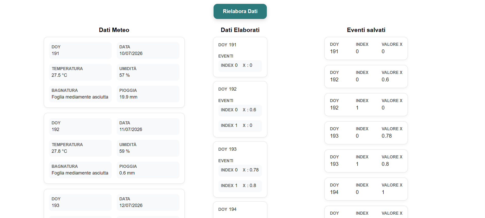

# test-backend-primo-principio

Test backend per candidatura sviluppatore software presso Primo Principio



## Indice

- [Descrizione della struttura](#descrizione-della-struttura)
- [Componenti del progetto](#componenti-del-progetto)
- [API esterne al progetto usate](#api-esterne-al-progetto-usate)
- [Requisiti](#requisiti)
- [Avvio del progetto con Docker Compose](#avvio-del-progetto-con-docker-compose)
- [Avvio del progetto con Docker](#avvio-del-progetto-con-docker)
- [Servizi disponibili](#servizi-disponibili)
- [Esecuzione dei test](#esecuzione-dei-test)
- [Ispezione del database](#ispezione-del-database)

## Descrizione della struttura

- **`problema_1`** e **`problema_2`** sono le directory principali delle due API Django sviluppate per il test. Entrambe contengono:
  - la cartella **`config`**, con i file di configurazione del progetto Django;
  - la cartella **`api`**, che contiene modelli, views e la logica applicativa;
  - il file **`manage.py`**, utilizzato per la gestione del progetto Django;
  - il **`Dockerfile`** e il file **`requirements.txt`**, necessari rispettivamente per la containerizzazione e la gestione delle dipendenze.

- I **`test`** del progetto sono contenuti nel file **`tests.py`** presente nella cartella **`api`** di **`problema_1`**.

- **`problema_2`** contiene inoltre la cartella **`services`**, che ospita la logica per la comunicazione con l'API esterna **Open-Meteo**.

- **`frontend`** è la directory principale dell'applicazione sviluppata con **React** e **Vite**. La cartella **`src`** contiene il codice sorgente dell'applicazione e, in particolare:
  - **`components`**, che raccoglie tutti i componenti React;
  - **`styles`**, che contiene i file di stile utilizzati dai componenti.

- All'interno del file **`views.py`** di **`problema_1`** sono presenti due versioni della funzione richiesta:
  - **`dati_meteo_v1`**: implementa la soluzione richiesta dal Problema 1;
  - **`dati_meteo_v2`**: estende la versione `dati_meteo_v1` con le modifiche necessarie per soddisfare i requisiti del Problema 2.

## Componenti del progetto

**`problema_1`**: API target che riceve dall'API `problema_2` i dati meteorologici, li elabora e restituisce i risultati a `problema_2`.

**`problema_2`**: API che acquisisce i dati meteorologici dall'API esterna Open-Meteo, li invia all'API `problema_1` per l'elaborazione e salva i risultati ottenuti.

**`frontend`**: applicazione React che comunica con l'API `problema_2` per visualizzare i dati meteorologici e gli eventi elaborati.

## API esterne al progetto usate

[Open-Meteo](https://open-meteo.com/)

## Requisiti

- Docker Desktop oppure Docker Engine con Docker Compose.
- Repository del progetto clonata in locale.

## Avvio del progetto con Docker Compose

Eseguire i seguenti comandi dalla directory principale del progetto.

### 1. Avvio dei servizi

```bash
docker compose up --build
```

Il database PostgreSQL viene inizializzato automaticamente e, all'avvio del container di `problema_2`, vengono eseguite automaticamente le migrazioni Django.

### 2. Servizi disponibili

Una volta completato l'avvio, i servizi saranno disponibili agli indirizzi indicati nella sezione:

- [Servizi disponibili](#servizi-disponibili)

### Arrestare i servizi

```bash
docker compose down
```

### Arrestare i servizi ed eliminare il volume del database

```bash
docker compose down -v
```

### Arrestare i servizi ed eliminare anche le immagini locali

```bash
docker compose down --rmi local -v
```

## Avvio del progetto con Docker

Eseguire i seguenti comandi dalla directory principale del progetto.

### 1. Creazione della rete Docker

```bash
docker network create app-network
```

### 2. Costruzione dell’immagine di Problema 1

```bash
docker build -t problema-1 ./problema_1
```

### 3. Costruzione dell’immagine di Problema 2

```bash
docker build -t problema-2 ./problema_2
```

### 4. Costruzione dell’immagine del frontend

```bash
docker build -t frontend ./frontend
```

### 5. Avvio di PostgreSQL

```bash
docker run -d --name postgres --network app-network -e POSTGRES_DB=dockerdjango -e POSTGRES_USER=dbuser -e POSTGRES_PASSWORD=dbpassword -v problema-2-postgres-data:/var/lib/postgresql/data -p 5432:5432 postgres:17
```

Il database viene avviato utilizzando l'immagine ufficiale **`postgres:17`**. I dati vengono salvati nel volume Docker **`problema-2-postgres-data`**.

### 6. Avvio di Problema 1

```bash
docker run -d --name problema-1 --network app-network --env-file ./problema_1/.env -p 8000:8000 problema-1
```

### 7. Avvio di Problema 2

```bash
docker run -d --name problema-2 --network app-network --env-file ./problema_2/.env -p 8001:8000 problema-2
```

### 8. Avvio del frontend

```bash
docker run -d --name frontend --network app-network -p 5173:5173 frontend
```

### 9. Esecuzione delle migrazioni Django di Problema 2

```bash
docker exec problema-2 python manage.py migrate
```

### 10. Servizi disponibili

Una volta completato l'avvio, i servizi saranno disponibili agli indirizzi indicati nella sezione:

- [Servizi disponibili](#servizi-disponibili)

### Arresto dei container

```bash
docker stop frontend problema-2 problema-1 postgres
```

### Rimozione dei container

```bash
docker rm frontend problema-2 problema-1 postgres
```

### Rimozione della rete

```bash
docker network rm app-network
```

### Rimozione delle immagini

```bash
docker rmi frontend problema-2 problema-1 postgres:17
```

### Rimozione del database

```bash
docker volume rm problema-2-postgres-data
```

## Servizi disponibili

I servizi sono disponibili dopo aver avviato il progetto tramite Docker Compose oppure Docker.

| Servizio   | URL                   |
| ---------- | --------------------- |
| Problema 1 | http://localhost:8000 |
| Problema 2 | http://localhost:8001 |
| Frontend   | http://localhost:5173 |
| PostgreSQL | localhost:5432        |

## Esecuzione dei test

### Test disponibili

- `DatiMeteoV1ApiTest`
  - verifica la creazione degli eventi;
  - verifica che `X` non diminuisca;
  - verifica che `X` non superi 1;
  - verifica l'aggiunta di nuovi eventi;
  - verifica l'incremento di `X` negli eventi esistenti.

- `DatiMeteoV2ApiTest`
  - verifica la propagazione degli eventi tra più giorni;
  - verifica l'aggiunta di eventi in giorni differenti;
  - verifica l'incremento di `X` negli eventi propagati.

### Tutti i test

Docker Compose:

```bash
docker compose exec problema-1 python manage.py test
```

Docker:

```bash
docker exec problema-1 python manage.py test
```

### Una classe di test

Docker Compose:

```bash
docker compose exec problema-1 python manage.py test api.tests.DatiMeteoV1ApiTest
```

Docker:

```bash
docker exec problema-1 python manage.py test api.tests.DatiMeteoV1ApiTest
```

### Un singolo test (esempio)

Docker Compose:

```bash
docker compose exec problema-1 python manage.py test api.tests.DatiMeteoV1ApiTest.test_crea_evento_quando_le_condizioni_sono_vere
```

Docker:

```bash
docker exec problema-1 python manage.py test api.tests.DatiMeteoV1ApiTest.test_crea_evento_quando_le_condizioni_sono_vere
```

## Ispezione del database

Per visualizzare i dati presenti nel database è necessario aprire almeno una volta il frontend ed eseguire una richiesta all'API `problema_2`, in modo da salvare gli eventi nel database.

### Accedere alla console PostgreSQL

Docker Compose:

```bash
docker compose exec postgres psql -U dbuser -d dockerdjango
```

Docker:

```bash
docker exec postgres psql -U dbuser -d dockerdjango
```

### Visualizzare le tabelle

```sql
\dt
```

### Uscire dalla console PostgreSQL

```sql
\q
```

### Visualizzare tutti i dati degli eventi

```sql
SELECT * FROM api_storicoeventi;
```

### Visualizzare i dati di uno specifico evento (in questo esempio l'evento con `event_index = 0`) ordinati per `doy`

```sql
SELECT * FROM api_storicoeventi
WHERE event_index = 0
ORDER BY doy ASC;
```
