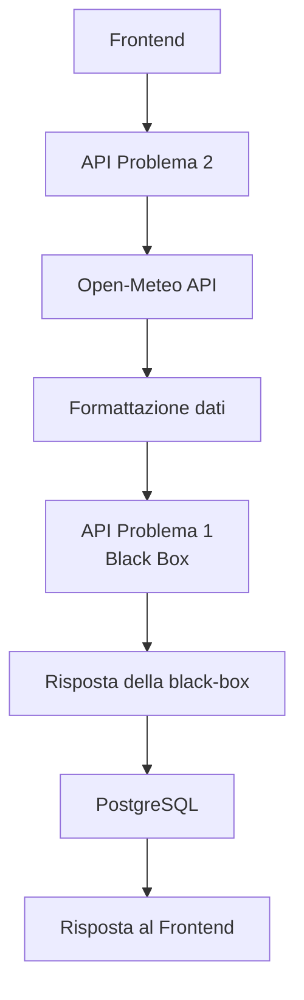

# Descrizione teorica del Problema 2

## Indice

- [Soluzione progettuale](#soluzione-progettuale)
- [Flusso di elaborazione](#flusso-di-elaborazione)
- [Complessità algoritmica](#complessità-algoritmica)

## Soluzione progettuale

La soluzione proposta è composta da due componenti principali che collaborano tra loro.

La prima componente è l'API problema_1 sviluppata nel Problema 1, utilizzata come black-box. Essa riceve in ingresso i dati meteorologici giornalieri e restituisce, per ciascun giorno elaborato, lo stato degli eventi rappresentato dalle coppie (index, X). L'API implementa esclusivamente la logica di evoluzione degli eventi e non si occupa della loro persistenza.

La seconda componente è l'API problema_2 sviluppata per il Problema 2, che svolge il ruolo di orchestratore dell'intero processo. Essa acquisisce i dati meteorologici tramite il servizio Open-Meteo e li converte nel formato richiesto dalla black-box.

Per ogni risposta ricevuta dal API problema_1, l'API del Problema 2 estrae il giorno (doy) e l'elenco degli eventi. Ogni evento viene identificato attraverso il proprio index e viene memorizzato nel database insieme al valore corrente di X e al giorno a cui appartiene.

Il database conserva quindi una nuova osservazione per ogni evento e per ogni giorno elaborato, evitando la duplicazione di dati già presenti. In questo modo viene conservata l'intera evoluzione temporale del valore X associato a ciascun evento, rendendone possibile la ricostruzione cronologica.

## Flusso di elaborazione

## Complessità algoritmica e strutture dati

- n = numero di giorni ricevuti;
- m = numero di eventi presenti in un singolo giorno;
- M = numero totale di eventi elaborati nell'intera risposta (M = Σmᵢ)

| Operazione                              | Parte del codice                             | Tempo           | SPAZIO    |
| --------------------------------------- | -------------------------------------------- | --------------- | --------- |
| Aggiornamento di X                      | aggiorna_x()                                 | O(1)            | O(1)      |
| Verifica condizioni meteorologiche      | espressione condizioni_evento                | O(1)            | O(1)      |
| Ricerca del nuovo index                 | max(evento["index"] for evento in eventi)    | O(m)            | O(1)      |
| Ricerca dell’ultimo giorno con eventi   | for giorno_eventi in reversed(lista_eventi)  | O(n)            | O(1)      |
| Aggiornamento degli eventi di un giorno | for evento in ultimo_giorno["events"]        | O(m)            | O(m)      |
| Creazione degli oggetti da salvare      | eventi_da_salvare                            | O(M)            | O(M)      |
| Elaborazione dell’intero batch          | gestisci_eventi()                            | O(n²)           | O(n²)     |

 

- Aggiornamento di X:
  La funzione aggiorna_x esegue un numero costante di operazioni aritmetiche e scelte casuali. La sua complessità temporale è quindi O(1) e quella spaziale ausiliaria è O(1).
- Verifica delle condizioni meteorologiche:
  La verifica utilizza un numero costante di confronti sui valori di bagnatura, pioggia, umidità e temperatura. La complessità temporale e spaziale è quindi O(1).
- Ricerca del nuovo index:
  Quando sono già presenti m eventi, la funzione ricerca il massimo valore di index scorrendo la lista. La complessità temporale è O(m), mentre lo spazio ausiliario è O(1).
- Ricerca dell’ultimo giorno con eventi:
  La scansione a ritroso della lista può esaminare fino a n giorni, quindi una singola ricerca richiede O(n) tempo e O(1) spazio.
- Aggiornamento degli eventi di un giorno:
  Per aggiornare gli eventi del giorno corrente, il sistema visita tutti gli m eventi dello stato precedente e crea una nuova lista. La complessità temporale e spaziale è quindi O(m).
- Creazione degli oggetti da salvare:
  La lista eventi_da_salvare viene costruita visitando una sola volta tutte le M osservazioni presenti nella risposta. La complessità temporale e spaziale è O(M).
- Elaborazione dell’intero batch:
  Comprende tutte le operazioni eseguite dalla funzione gestisci_eventi(): ricerca dell'ultimo giorno contenente eventi, aggiornamento dei valori X, eventuale creazione di nuovi eventi e costruzione della risposta. La complessità temporale è O(n² + M), dove n rappresenta il numero di giorni elaborati e M il numero complessivo di eventi processati. Nel caso peggiore, se il numero di eventi cresce linearmente con il numero di giorni, M = O(n²) e la complessità complessiva diventa O(n²).
